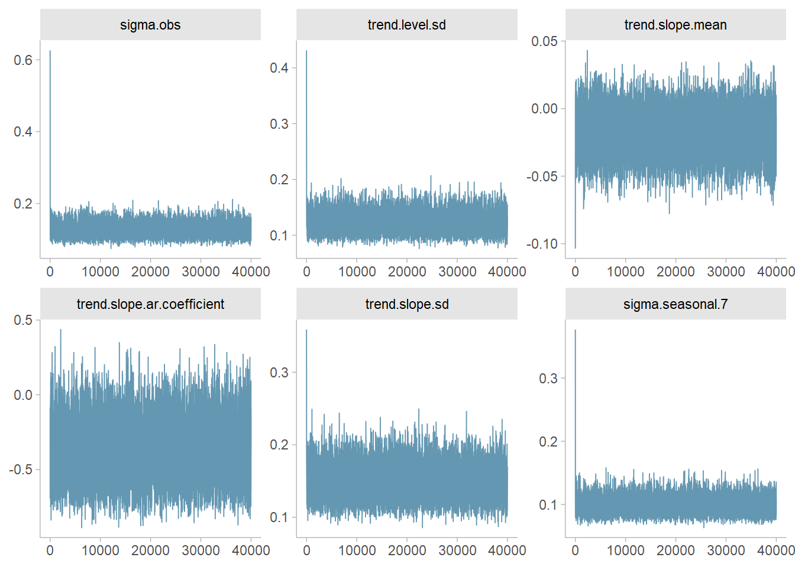
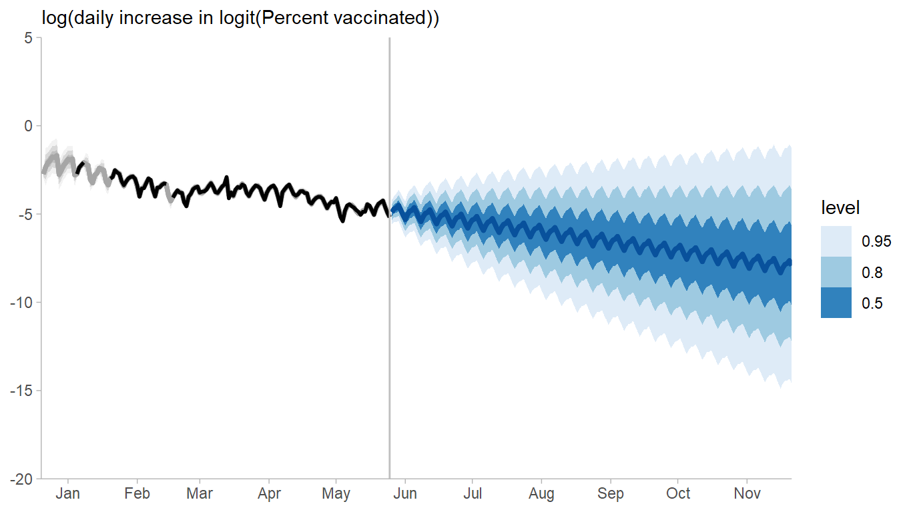
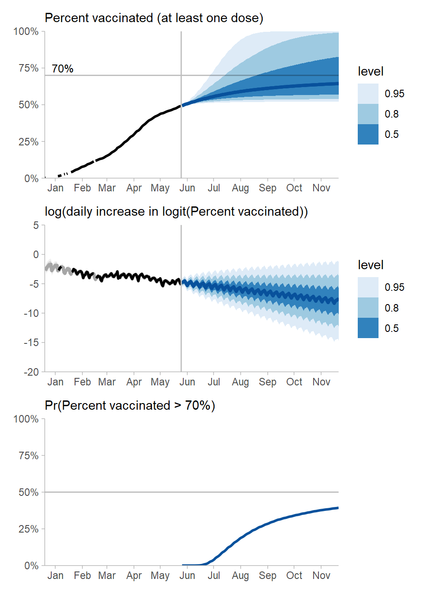
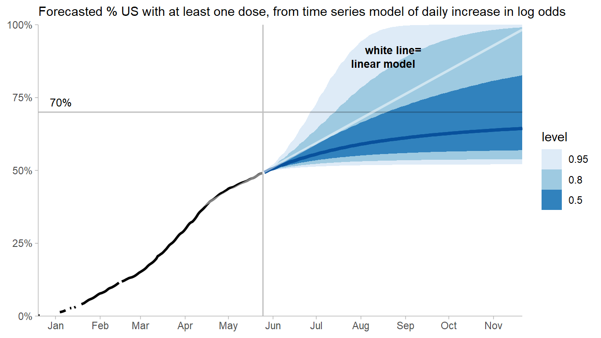

Vaccination rate in the US
================
Matthew Kay
4/26/2021

The [New York Time vaccine
tracker](https://www.nytimes.com/interactive/2020/us/covid-19-vaccine-doses.html)
currently shows a predicted proportion of people vaccinated if
vaccination continues “at the current pace”, using a linear projection.
I thought it might be helpful to try to add some uncertainty to that
line in a way that does not assume a linear trend.


## Libraries needed for this analysis:

``` r
library(lubridate)
library(ggdist)
library(tidybayes)
library(bsts)
library(patchwork)
library(tidyverse)
library(magrittr)
library(posterior)   # pak::pkg_install("stan-dev/posterior")

theme_set(theme_ggdist())
```

## The data

I downloaded the data on what share of the population has recieved at
least one dose from
[ourworldindata.org](https://ourworldindata.org/coronavirus/country/united-states#what-share-of-the-population-has-received-at-least-one-dose-of-the-covid-19-vaccine):

``` r
df = read.csv("share-people-vaccinated-covid.csv") %>%
  filter(Entity == "United States") %>%
  transmute(
    date = as_date(Day),
    day = as.numeric(date - min(date)),
    vax = people_vaccinated_per_hundred / 100
  )

head(df)
```

    ##         date day    vax
    ## 1 2020-12-20   0 0.0017
    ## 2 2020-12-21   1 0.0018
    ## 3 2020-12-23   3 0.0030
    ## 4 2020-12-26   6 0.0058
    ## 5 2020-12-28   8 0.0064
    ## 6 2020-12-30  10 0.0084

The data looks like this:

``` r
df %>%
  ggplot(aes(date, vax)) +
  geom_point()
```


## NYT-like linear model

First off, we can approximate what NYT is doing using linear regression
based on the last couple of points (this doesn’t line up exactly with
their model but it seems close):

``` r
df %>%
  ggplot(aes(date, vax)) +
  geom_point() +
  stat_smooth(formula = y ~ x, method = lm, se = FALSE, data = . %>% filter(row_number() > n() - 8), fullrange = TRUE) +
  scale_x_date(limits = c(min(df$date), make_date(2021, 10, 31))) +
  coord_cartesian(ylim = c(0, 1)) +
  geom_vline(xintercept = make_date(2021, 10, 12), alpha = 0.2) +
  geom_hline(yintercept = 0.9, alpha = 0.2) +
  annotate("text", x = make_date(2021, 5, 28), y = 0.92, label = "90%", hjust = 0, vjust = 0, size = 3.5) +
  annotate("text", x = make_date(2021, 10, 8), y = 0.5, hjust = 1, vjust = 0.5, label = "Oct 12", size = 3.5) 
```


However, instead of doing this I am going to fit a time series model to
the data.

## Data prep for time series model of daily changes

Analyzing the data on the raw scale is hard because (1) we know that the
percent of vaccinated people is bounded between 0 and 1 and (2) we know
that the percent of vaccinated people is always increasing. Combining
these two facts, we could instead look at the difference in the logit of
the percent of vaccinated people:

``` r
df_diff = df %>%
  select(-date) %>%
  complete(day = min(day):max(day)) %>%
  mutate(date = min(df$date) + days(day))

df_diff %>%
  ggplot(aes(date, c(NA, diff(qlogis(vax))))) +
  geom_line() +
  geom_point() +
  labs(y = "daily increase in logit(Percent vaccinated)")
```


Since we know that this difference must be positive (since the number of
vaccinated people cannot decrease), we might analyse this on a log
scale. That might also stabilize the variance:

``` r
df_log_diff = df_diff %>%
  mutate(log_diff_vax = c(NA, log(diff(qlogis(vax))))) %>%
  slice(-1)

df_log_diff %>%
  ggplot(aes(date, log_diff_vax)) +
  geom_line() +
  geom_point(na.rm = TRUE) +
  labs(y = "log(daily increase in logit(Percent vaccinated))")
```


There’s some missing data here, which we’ll let the model impute (FWIW I
also tried just using linear interpolation on the raw data prior to
translating it into differences and got very similar results to the
imputation approach).

## Time series model

This seems a good point to fit a time series model. We’ll fit a Bayesian
Structural Time Series model with `bsts()`. We’ll use a semi-local
linear trend [intended for long-term
forecasting](https://www.unofficialgoogledatascience.com/2017/07/fitting-bayesian-structural-time-series.html).
There’s a clear weekly trend in the numbers, which is to be expected
given differences in vaccination rates on the weekend, so we’ll also
include a seasonal component with a 7-day period. Since we’re on a log
scale even changes by as much as 0.5 or 1 are large, we’ll use some
tight-ish-looking priors here:

``` r
m = with(df_log_diff, bsts(log_diff_vax, 
  state.specification = list() %>%
    AddSemilocalLinearTrend(log_diff_vax,
      level.sigma.prior = SdPrior(0.5, 1),
      slope.mean.prior = NormalPrior(0,0.5),
      initial.level.prior = NormalPrior(0,0.5),
      initial.slope.prior = NormalPrior(0,0.5),
      slope.sigma.prior = SdPrior(0.5, 1),
      slope.ar1.prior = Ar1CoefficientPrior(0, 0.5)
    ) %>%
    AddSeasonal(log_diff_vax, 7, 
      sigma.prior = SdPrior(0.5, 1)
    ),
  prior = SdPrior(0.5, 1),
  niter = 40000,
  seed = 4272021 # for reproducibility
))
```

    ## =-=-=-=-= Iteration 0 Mon May 03 20:25:16 2021
    ##  =-=-=-=-=
    ## =-=-=-=-= Iteration 4000 Mon May 03 20:25:22 2021
    ##  =-=-=-=-=
    ## =-=-=-=-= Iteration 8000 Mon May 03 20:25:27 2021
    ##  =-=-=-=-=
    ## =-=-=-=-= Iteration 12000 Mon May 03 20:25:33 2021
    ##  =-=-=-=-=
    ## =-=-=-=-= Iteration 16000 Mon May 03 20:25:39 2021
    ##  =-=-=-=-=
    ## =-=-=-=-= Iteration 20000 Mon May 03 20:25:44 2021
    ##  =-=-=-=-=
    ## =-=-=-=-= Iteration 24000 Mon May 03 20:25:50 2021
    ##  =-=-=-=-=
    ## =-=-=-=-= Iteration 28000 Mon May 03 20:25:56 2021
    ##  =-=-=-=-=
    ## =-=-=-=-= Iteration 32000 Mon May 03 20:26:01 2021
    ##  =-=-=-=-=
    ## =-=-=-=-= Iteration 36000 Mon May 03 20:26:06 2021
    ##  =-=-=-=-=

Some diagnostics:

``` r
draws = as_draws(do.call(cbind, m[startsWith(names(m), "trend") | startsWith(names(m), "sigma")]))
summary(draws, median, mad, quantile2, default_convergence_measures())
```

    ## # A tibble: 6 x 8
    ##   variable                median    mad      q5      q95  rhat ess_bulk ess_tail
    ##   <chr>                    <dbl>  <dbl>   <dbl>    <dbl> <dbl>    <dbl>    <dbl>
    ## 1 sigma.obs               0.131  0.0181  0.105   0.165    1.00    4945.   10490.
    ## 2 trend.level.sd          0.125  0.0171  0.101   0.158    1.00    4430.    8604.
    ## 3 trend.slope.mean       -0.0196 0.0147 -0.0439  0.00479  1.00   11187.   18982.
    ## 4 trend.slope.ar.coeffi~ -0.419  0.187  -0.683  -0.0855   1.00    3881.    8007.
    ## 5 trend.slope.sd          0.152  0.0220  0.121   0.194    1.00    5101.   10674.
    ## 6 sigma.seasonal.7        0.106  0.0127  0.0876  0.130    1.00    5664.   10653.

``` r
bayesplot::mcmc_trace(draws)
```



## Predictions

Now we’ll generate fits and predictions for a 180-day forecast:

``` r
forecast_days = 180

fits = df_log_diff %>%
  add_draws(colSums(aperm(m$state.contributions, c(2, 1, 3))))

predictions = df_diff %$%
  tibble(date = max(date) + days(1:forecast_days)) %>%
  add_draws(predict(m, horizon = forecast_days)$distribution, value = "log_diff_vax")
```

Predictions from the model look like this (with imputed missing data in
gray):

``` r
predictions %>%
  ggplot(aes(date, log_diff_vax)) +
  stat_lineribbon(aes(y = .value, fill_ramp = stat(level)), data = fits, fill = "gray75", color = "gray65") +
  stat_lineribbon(color = "#08519c") +
  scale_fill_brewer() +
  geom_line(data = df_log_diff) +
  geom_point(data = df_log_diff, na.rm = TRUE) +
  theme_ggdist() +
  labs(y = "log(daily change in logit(Percent vaccinated))")
```



There is quite a bit of uncertainty here, especially for far-out
forecasts.

We can translate these predictions of differences into predictions of
percent vaccinated by inverting the log, cumulatively summing
differences in log odds, then inverting the logit transformation:

``` r
pred_vax = predictions %>%
  group_by(.draw) %>%
  mutate(
    vax = plogis(cumsum(c(
      qlogis(tail(df_diff$vax, 1)) + exp(log_diff_vax[[1]]),
      exp(log_diff_vax[-1])
    )))
  )
```

Now we can plot the latent model alongside predictions of vaccination
rate and the predicted probability that the proportion of vaccinated
people is above some threshold (say, 70%):

``` r
x_dates = seq(make_date(2021, 1, 1), max(predictions$date), by = "month")
x_scale = list(
  scale_x_date(
    limits = range(df_diff$date, predictions$date),
    breaks = x_dates,
    labels = months(x_dates, abbreviate = TRUE)
  ),
  coord_cartesian(expand = FALSE) 
)

summer_line = geom_vline(xintercept = make_date(2021, 9, 22), alpha = 0.25)

widths = c(.5, .8, .95)

vaxed = pred_vax %>%
  ggplot(aes(date, vax)) +
  stat_lineribbon(.width = widths, color = "#08519c") +
  scale_fill_brewer() +
  geom_line(data = df_diff, size = 1) +
  geom_hline(yintercept = .7, alpha = 0.25) +
  summer_line +
  scale_y_continuous(limits = c(0,1), labels = scales::percent_format()) +
  x_scale +
  theme_ggdist() +
  annotate("text", x = make_date(2020, 12, 28), y = 0.72, label = "70%", hjust = 0, vjust = 0, size = 3.25) +
  annotate("text", x = make_date(2021, 9, 19), y = 0.25, hjust = 1, vjust = 0.5, label = "Sept 22\n End of summer", size = 3.25, lineheight = 1.05) +
  labs(
    subtitle = "Percent vaccinated (at least one dose)",
    y = NULL,
    x = NULL
  )

diffs = predictions %>%
  ggplot(aes(date, log_diff_vax)) +
  stat_lineribbon(aes(y = .value, fill_ramp = stat(level)), data = fits, fill = "gray75", color = "gray65") +
  stat_lineribbon(.width = widths, color = "#08519c") +
  geom_line(data = df_log_diff, size = 1) +
  summer_line +
  scale_fill_brewer() +
  theme_ggdist() +
  x_scale +
  labs(
    subtitle = "log(daily increase in logit(Percent vaccinated))",
    y = NULL,
    x = NULL
  )


prob = pred_vax %>%
  group_by(date) %>%
  summarise(prob_vax_gt_70 = mean(vax > .70)) %>%
  ggplot(aes(date, prob_vax_gt_70)) +
  geom_line(color = "#08519c", size = 1) +
  theme_ggdist() +
  geom_hline(yintercept = 0.5, alpha = 0.25) +
  summer_line +
  scale_y_continuous(limits = c(0,1), labels = scales::percent_format()) +
  x_scale +
  labs(
    subtitle = "Pr(Percent vaccinated > 70%)",
    y = NULL,
    x = NULL
  )

vaxed / diffs / prob
```



This gives us a final chart like this:

``` r
vaxed +
  stat_smooth(formula = y ~ x, method = lm, se = FALSE,
    data = df %>% filter(row_number() > n() - 8), 
    fullrange = TRUE, color = scales::alpha("white", 0.5), size = 1
  ) +
  annotate("text", 
    label = "white =\nlinear model  ", 
    fontface = "bold", x = make_date(2021, 9, 12), y = .89, color = "white", hjust = 1, size = 3.25, lineheight = 1.05
  ) +
  labs(
    subtitle = "Forecasted % US with at least one dose, from time series model of daily increase in log odds"
  )
```



Anyway, my conclusion from all of this is essentially that there is *a
lot* of uncertainty in what the vaccination rate will be, at least if we
just look at the raw numbers, and doubtless the model I’ve shown here is
way oversimplified — but I have some trepidation about looking at even
simpler models (like linear projections) and ignoring their uncertainty,
as this is probably going to be at least a little misleading.
